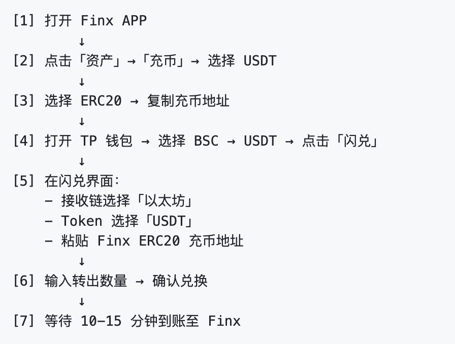

# 如何将 TP 钱包内 BSC 资产入金至 Finx？

1. 打开 Finx APP 后点击底部 **「资产」** 按钮进入资产页面；
2. 在 **「资产」** 页面点击 **「充币」** 按钮，并选择 **USDT** 进行充值；
3. 点击 **ERC20** 按钮，并保持二维码和「充币地址」（**充币地址与账户关联，可重复使用**）；
4. 打开 TP 钱包 → 选择 **BSC** → 选择 **USDT** → 点击 **「闪兑」**（若无闪兑按钮则需开启 VPN）；
5. 在 **闪兑 & 跨链** 界面中点击 **「接收」** 按钮，并点击 **以太坊** → 选择 **USDT**，此时会提示输入“目标钱包地址”，将第 3 步中复制的「充币地址」粘贴至此即可；
6. 在 **闪兑 & 跨链** 界面中输入 BSC USDT 转出数量，系统会自动计算手续费和最优兑换路径，点击 **「确认兑换」** 即可；

> ⚠️ 此过程属于跨链操作，预计 **10-15 分钟后** 可在 Finx APP 中到账。


### 简化版流程如下：




```mermaid
flowchart TD
    A[打开 Finx APP] --> B[点击底部「资产」按钮]
    B --> C[进入资产页面，点击「充币」按钮]
    C --> D[选择 USDT 进行充值]
    D --> E[点击 ERC20 按钮，获取二维码和充币地址（可重复使用）]
    E --> F[打开第三方交易所]
    F --> G[进入「资产」界面，点击转账按钮 -> 选择「链上提现」]
    G --> H[选择 USDT 币种]
    H --> I[粘贴第 3 步获取的充币地址为“目标钱包地址”]
    I --> J[选择网络：Ethereum(ERC20)]
    J --> K[输入提现数量]
    K --> L[点击提现，完成转账]
